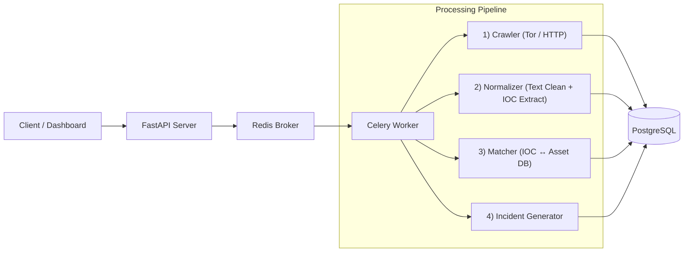
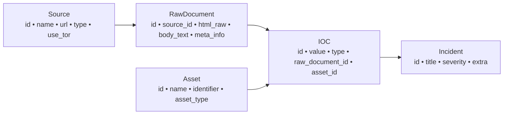

# 🕵️ DotasPlus — Automated Dark-web OSINT Threat Intelligence Engine


**DotasPlus** 는 다크웹(.onion) 및 OSINT 소스로부터 보안 관련 데이터를 자동 수집·정규화하고  
조직 자산(Asset)과 매칭하여 **실질적인 Incident(침해 징후)** 를 생성하는 CTI(Threat Intelligence) 엔진입니다.

---

# ✨ Features

- 🌐 Tor 기반 Dark-web 자동 수집  
- 🧹 본문 추출 + IOC 정규화 엔진  
- 🎯 Asset 기반 Threat Matching  
- ⚡ Celery 기반 비동기 파이프라인  
- 🐳 Docker Compose 기반 배포  
- 🔌 확장 가능한 구조 (LLM Parser / Sandbox / Dashboard 연동 예정)

---

# 🏗 Architecture



---

# 🔧 Core Pipeline

### **1) Crawling Layer**
- Tor(SOCKS5h) 지원  
- Raw HTML + Metadata 저장  
- 다중 소스 병렬 수집

### **2) Normalization Layer**
- HTML 제거 후 본문 추출
- IOC 자동 추출 (IPv4, Domain, URL, Email, Crypto Wallet)
- LLM 기반 문맥 분석 확장 예정

### **3) Asset Matching Layer**
- IOC ↔ 조직 자산 매칭
- Non-actionable 데이터 제거
- Incident 자동 생성

---

# 📐 Data Model (Logical ERD)



---

# 📂 Project Structure

```
DotasPlus/
├── app/
│   ├── main.py               # FastAPI Entrypoint
│   ├── models.py             # SQLAlchemy ORM Models
│   ├── tasks.py              # Celery Async Pipeline
│   ├── api/                  # REST API Routes
│   ├── config.py             # Environment Settings
│   └── database.py           # DB Session Manager
├── docker-compose.yml        # Infrastructure Orchestration
├── Dockerfile                # App Container Build
├── requirements.txt          # Python Dependencies
└── .env.example              # Environment Variables Template
```

---

# 🔌 API Example

### **Register Asset**
```http
POST /api/v1/assets
{
  "name": "Corporate Domain",
  "identifier": "example.com",
  "asset_type": "domain"
}
```

### **Register Source**
```http
POST /api/v1/sources
{
  "name": "Leak Forum",
  "url": "http://exampleforum.onion",
  "type": "darkweb",
  "use_tor": true
}
```

### **Trigger Crawl**
```http
POST /api/v1/sources/{source_id}/run_crawl
```

---

# 🚀 Getting Started

### 1) Clone
```bash
git clone https://github.com/rasasoe/DotasPlus
cd DotasPlus
```

### 2) Env Setup
```bash
cp .env.example .env
```

### 3) Build & Run
```bash
docker-compose down -v
docker-compose up --build -d
```

### 4) API Docs
👉 http://localhost:8000/docs

---

# 🛡 Legal / Ethical Notice

- 본 프로젝트는 **보안 방어·연구 목적**의 CTI 도구입니다.  
- 불법 행위(무단 침투, 데이터 유통 등)에 사용될 수 없으며, 모든 책임은 사용자에게 있습니다.  
- Tor/Dark-web 접근은 **각 국가 법률을 반드시 준수**해야 합니다.

---

# 🛣 Roadmap

- [x] Dark-web/OSINT Crawling  
- [x] IOC Extract + Asset Matching  
- [ ] LLM Semantic Parser  
- [ ] React Dashboard  
- [ ] Slack/Telegram Notification  
- [ ] Multi-Worker Scaling  
- [ ] Sandbox Integration  

---

# 📜 License  
MIT License
