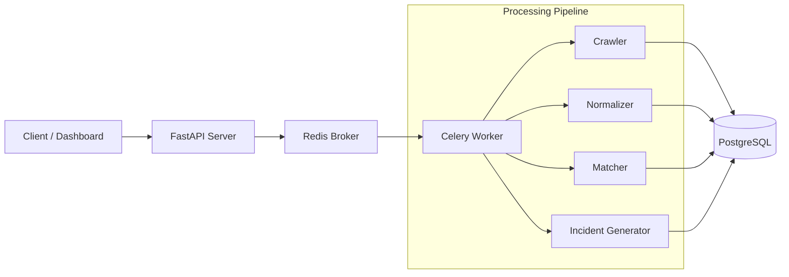

# DotasPlus — Automated Dark-web OSINT Threat Intelligence Engine


**DotasPlus**는 다크웹(.onion) 및 OSINT 소스에서 보안 관련 정보를 자동으로 수집, 정규화, 연관 분석하는 **위협 인텔리전스(CTI) 파이프라인**입니다.  
비정형 데이터를 구조화된 침해지표(IOC)로 변환하고, 조직의 자산(Asset)과 매칭하여 실제 보안 위협(Incident)을 식별합니다.

시스템은 **확장성(Extensibility)**, **모듈화(Modularity)**, **고성능 비동기 처리(Async Processing)** 에 중점을 두고 설계되었습니다.

---

## 🎯 Objectives (목표)

- 다크웹 및 OSINT 소스로부터 위협 신호 자동 수집
- 비정형 콘텐츠 정규화 및 IOC 자동 추출
- 자산 기반(Asset-centric) 위협 연관 분석
- 위협 우선순위화 및 실질적 인시던트 식별
- LLM·샌드박스·대시보드 연동을 고려한 확장 가능한 구조

---

## 🧩 System Overview (시스템 개요)

| 컴포넌트 | 역할 | 설명 |
|----------|------|-------------|
| **FastAPI** | API Gateway | REST API 제공 및 파이프라인 트리거 |
| **Celery Worker** | Processing Engine | 크롤링, 분석, 매칭 등 비동기 작업 수행 |
| **Redis** | Message Broker | 태스크 큐 관리 및 분산 실행 |
| **PostgreSQL** | Storage | 자산, 소스, RawData, Incident 저장 |
| **Tor Proxy** | Network Layer | .onion 리소스 접근 및 익명성 보장 |

---

## 🛠 Architecture (아키텍처)



---

## ⚙️ Core Pipeline (핵심 파이프라인)

### 1. Crawling Layer (수집 계층)
- Tor(SOCKS5h) 기반 dark-web 크롤링 지원  
- Raw HTML + 메타데이터를 그대로 아카이빙  
- 다중 소스 비동기 병렬 처리

### 2. Normalization Layer (정규화 계층)
- HTML 제거 및 본문 텍스트 추출  
- Regex 기반 IOC 자동 추출  
  - IPv4, Domain, URL, Email, Crypto Wallet  
- LLM 기반 Semantic Parsing 확장 가능 구조

### 3. Asset Matching Layer (자산 매칭 계층)
- IOC ↔ 조직 자산 연관성 분석  
- Non-actionable 데이터 필터링  
- Severity 등급 기반 Incident 자동 생성

---

## 📂 Project Structure (프로젝트 구조)

```
DotasPlus/
├── app/
│   ├── main.py               # FastAPI Entrypoint
│   ├── models.py             # SQLAlchemy ORM Models
│   ├── tasks.py              # Celery Pipeline Logic
│   ├── api/                  # REST API Routes
│   ├── config.py             # Environment Settings
│   └── database.py           # DB Session Manager
├── docker-compose.yml        # Infrastructure Orchestration
├── Dockerfile                # Application Image Build
├── requirements.txt          # Python Dependencies
└── .env.example              # Environment Variables Template
```

---

## 🔍 API Specification (API 명세)

### Register Asset
```http
POST /api/v1/assets
{
  "name": "Corporate Domain",
  "identifier": "example.com",
  "asset_type": "domain"
}
```

### Register Source
```http
POST /api/v1/sources
{
  "name": "Leak Forum",
  "url": "http://exampleforum.onion",
  "type": "darkweb",
  "use_tor": true
}
```

### Trigger Crawling
```http
POST /api/v1/sources/{id}/run_crawl
```

---

## 🧪 Getting Started (시작하기)

```bash
# 1. Repository Clone
git clone https://github.com/rasasoe/DotasPlus
cd DotasPlus

# 2. 환경 변수 설정 (.env.example 참고)

# 3. Docker 실행
docker-compose down -v
docker-compose up --build -d
```

API 문서 확인:  
👉 http://localhost:8000/docs

---

## 📈 Technical Advantages (기술적 장점)

- 모듈형 아키텍처로 기능 추가/수정 용이  
- 고성능 비동기 기반 파이프라인  
- 자산 중심 위협 분석으로 실무 적용성 높음  
- LLM 및 Sandbox 통합 확장 가능  
- API / Worker / Storage 계층 간 역할 완전 분리

---

## 🗺 Roadmap (로드맵)

- [x] 다크웹/OSINT 비동기 크롤링
- [x] IOC 추출 + 자산 매칭
- [ ] LLM 기반 문맥 분석 모듈
- [ ] React 기반 위협 대시보드
- [ ] Slack/Telegram 알림 시스템
- [ ] Multi-Worker 분산 확장

---

## 📄 License
MIT License
