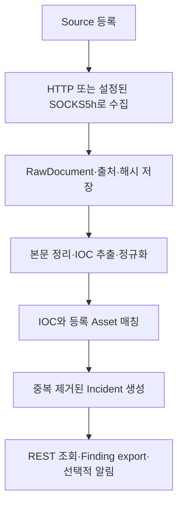
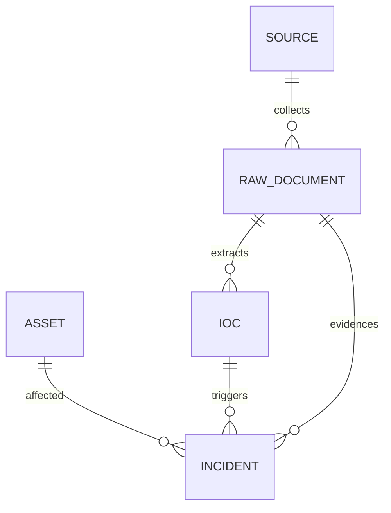

# DotasPlus

> 외부 위협 소스에서 문서를 수집하고 IOC를 정규화한 뒤, 보호 자산과의 연관성을 Incident로 만드는 CTI 파이프라인 프로토타입

[](https://www.python.org/)
[](https://fastapi.tiangolo.com/)
[](https://docs.celeryq.dev/)
[](#안전-경계)

DotasPlus는 수집량 자체보다 **출처 → 원문 → IOC → 보호 자산 → Incident**의 추적 가능한 흐름을 구현하는 데 초점을 둡니다. 기본 실행은 일반 HTTP와 로컬 fixture를 대상으로 하며, Tor 경로는 별도 SOCKS5h 프록시가 명시된 경우에만 사용합니다.

## 보안 포트폴리오에서의 역할

| 프로젝트 | 관찰 대상 | 역할 |
|---|---|---|
| **DotasPlus** | 외부 위협 문서·IOC | CTI 수집·정규화·자산 연관 분석 |
| [Python ASM Framework](https://github.com/rasasoe/python-asm-framework) | 운영 자산의 서비스·노출·CVE 맥락 | Attack Surface Management |
| [VSH](https://github.com/rasasoe/VSH) | 소스 코드·의존성·SBOM | AppSec 대표 프로젝트 |

세 저장소는 책임을 분리하고, 각 결과를 `schema_version: "1.0"` 기반 Finding 계약으로 맞춘 뒤 향후 별도 통합 뷰가 소비하는 방향으로 발전시킵니다.

## 처리 워크플로우


```mermaid
flowchart TD
    A["Source 등록"] --> B["HTTP 또는 설정된 SOCKS5h로 수집"]
    B --> C["RawDocument·출처·해시 저장"]
    C --> D["본문 정리·IOC 추출·정규화"]
    D --> E["IOC와 등록 Asset 매칭"]
    E --> F["중복 제거된 Incident 생성"]
    F --> G["REST 조회·Finding export·선택적 알림"]
```

| 단계 | 핵심 동작 | 남는 근거 |
|---|---|---|
| 수집 | Source 설정에 따라 HTTP 요청 | URL, HTTP 상태, 원문, SHA-256 |
| 정규화 | URL·도메인·IPv4·이메일 추출 | RawDocument별 IOC 레코드 |
| 매칭 | IOC 유형에 맞춰 Asset 식별자 비교 | Asset–IOC–RawDocument 관계 |
| Incident | 자산 중요도로 심각도 산정 | dedup key, 설명, evidence |
| 내보내기 | 공통 Finding 계약으로 변환 | source, asset, severity, confidence, references |

## 현재 구현 범위

- FastAPI 기반 Source·Asset 등록, 비동기 task 상태 및 Incident 조회
- Celery 큐 기반 `crawl → normalize → match → alert` 처리
- PostgreSQL 원문·IOC·Incident 영속화
- 동일 Source의 동일 본문 SHA-256 중복 수집 방지
- Asset와 정규화 IOC 매칭 및 Incident 중복 방지
- Telegram 설정이 있을 때만 알림 전송, 그 외 콘솔 기록
- `GET /api/v1/incidents/findings` 공통 Finding JSON 내보내기
- SQLite 메모리 DB와 로컬 HTML fixture를 사용한 네트워크 없는 테스트
- Docker Compose에 포함된 Nginx fixture로 승인된 로컬 수집 흐름 재현
- Source host allowlist와 redirect 차단으로 서버 측 임의 URL 요청 범위 제한

## 데이터 관계


```mermaid
erDiagram
    SOURCE ||--o{ RAW_DOCUMENT : collects
    RAW_DOCUMENT ||--o{ IOC : extracts
    ASSET ||--o{ INCIDENT : affected
    IOC ||--o{ INCIDENT : triggers
    RAW_DOCUMENT ||--o{ INCIDENT : evidences
```

## 빠른 시작

### 1. 환경 설정

```bash
cp .env.example .env
docker compose up --build -d
```

기존 개발 DB가 이전 스키마로 만들어진 경우에만 로컬 볼륨을 초기화합니다.

```bash
docker compose down -v
docker compose up --build -d
```

API 문서는 `http://localhost:8000/docs`에서 확인할 수 있습니다.

### 2. 보호 자산 등록

```http
POST /api/v1/assets
Content-Type: application/json

{
  "name": "Corporate Domain",
  "identifier": "example.com",
  "asset_type": "domain",
  "criticality": 4
}
```

지원하는 대표 Asset 유형은 `domain`, `email`, `ip`, `url`, `keyword`입니다.

### 3. 수집 Source 등록

일반 웹이나 로컬 실습 Source:

```http
POST /api/v1/sources
Content-Type: application/json

{
  "name": "Local OSINT Fixture",
  "type": "osint",
  "url": "http://fixture/sample.html",
  "use_tor": false
}
```

`fixture`는 Compose 내부에서만 해석되는 서비스 이름이며, 호스트에서는 `http://localhost:8088/sample.html`로 같은 문서를 확인할 수 있습니다.

등록 후 다음 요청으로 비동기 작업을 시작합니다.

```http
POST /api/v1/sources/1/crawl
```

응답의 `task_id`는 다음 경로에서 진행 상태를 확인합니다.

```http
GET /api/v1/tasks/{task_id}
```

외부 Source를 수집하려면 먼저 `.env`의 허용 목록에 정확한 호스트나 상위 도메인을 추가해야 합니다.

```env
SOURCE_HOST_ALLOWLIST=fixture,localhost,127.0.0.1,feeds.example.org
```

자동 HTTP redirect는 따라가지 않습니다. 목적지가 바뀌면 새 호스트를 검토·허용한 뒤 Source URL을 직접 갱신하는 방식입니다.

### 4. Incident와 공통 Finding 조회

```http
GET /api/v1/incidents
GET /api/v1/incidents/findings
```

Finding은 ASM과 같은 상위 필드 구조를 사용합니다.

```json
{
  "schema_version": "1.0",
  "generated_at": "2026-01-01T00:00:00+00:00",
  "findings": [
    {
      "source": "DotasPlus",
      "asset": {"type": "domain", "value": "example.com"},
      "finding_type": "threat_intelligence.asset_indicator_match",
      "severity": "high",
      "score": 80,
      "confidence": 0.9,
      "evidence": {},
      "references": [],
      "detected_at": "2026-01-01T00:00:00+00:00"
    }
  ]
}
```

## Tor 사용 원칙

DotasPlus는 Tor 데몬이나 프록시를 자체 설치·실행하지 않습니다. `.onion` Source는 반드시 `use_tor: true`여야 하며, `TOR_PROXY_URL`이 비어 있거나 `socks5h://`가 아니면 **일반 인터넷으로 우회 접속하지 않고 실패**합니다.

명시적으로 승인된 연구 환경에서 별도 SOCKS5h 프록시를 준비한 경우에만 다음처럼 설정합니다.

```env
TOR_PROXY_URL=socks5h://approved-proxy:9050
```

## 테스트

```bash
python -m unittest discover -s tests -v
```

테스트는 다음 계약을 검증합니다.

- 모든 ORM 모델이 하나의 `app.database.Base`에 등록됨
- 로컬 HTML fixture에서 IOC가 정규화됨
- IOC가 보호 Asset과 매칭되어 Incident로 저장됨
- 동일 Asset–IOC 조합이 중복 Incident를 만들지 않음
- Tor Source가 프록시 미설정 시 fail-closed로 중단됨
- 허용 목록 밖의 Source와 자동 redirect가 차단됨
- Incident가 `schema_version: "1.0"` Finding으로 변환됨

## 안전 경계

- 본인 또는 조직이 소유하거나 명시적으로 수집이 허용된 Source만 등록해야 합니다.
- 인증 우회, 침투, 페이로드 전달, 유출 데이터 구매·배포 기능은 포함하지 않습니다.
- IOC 매칭은 조사 우선순위를 만들기 위한 신호이며 실제 침해를 확정하지 않습니다.
- 크롤링 대상의 이용약관, 접근 정책, 개인정보·저작권·보관 요건을 준수해야 합니다.

## 현재 상태와 다음 단계

- 현재: 로컬 fixture로 재현 가능한 CTI 파이프라인 프로토타입
- 완료: ORM/API/task 계약 통일, IOC 영속화, 자산 매칭, Incident 중복 제거, 공통 Finding export
- 다음: Alembic migration, Source별 parser plugin, 재시도·rate limit 정책, VSH/ASM Finding을 함께 읽는 별도 통합 뷰

DotasPlus의 목표는 “다크웹을 많이 긁는 도구”가 아니라, **위협 정보의 출처와 판단 근거를 보존하면서 조직 자산에 연결하는 방어형 CTI 워크플로우**를 보여주는 것입니다.
